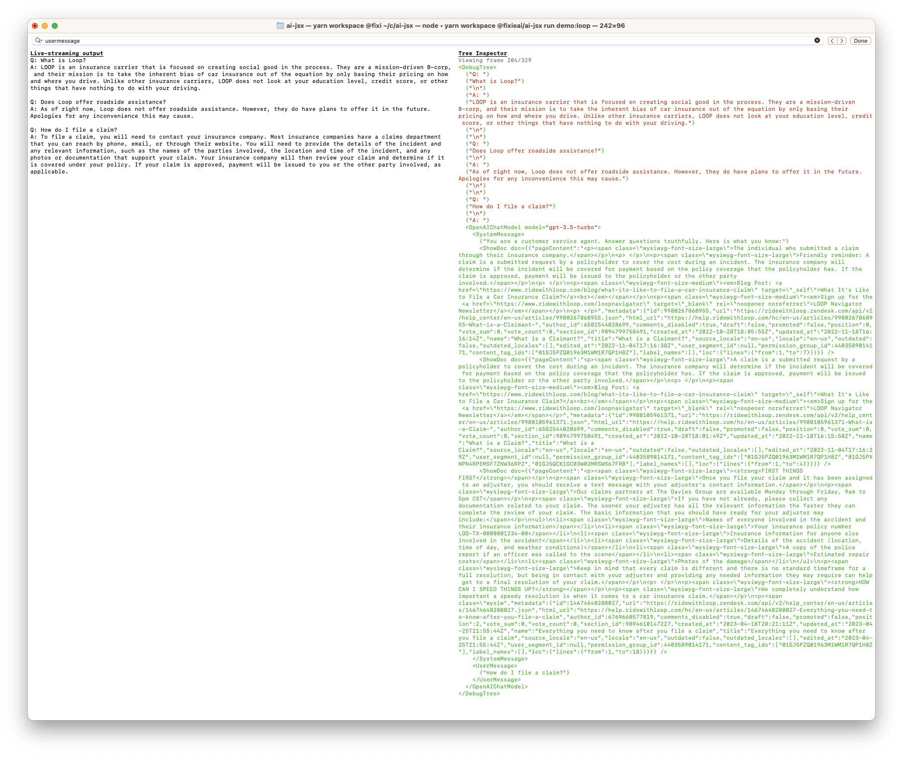

# Working in this repo

## Monorepo

We use [TurboRepo](https://turbo.build/repo) and [yarn workspaces](https://yarnpkg.com/features/workspaces/#gatsby-focus-wrapper) to manage the [monorepo](https://turbo.build/repo/docs/handbook).

```
# Run a command at the top level:
$ yarn test

# Run a command for a particular monorepo package
$ yarn workspace ai-jsx add my-package-name

# Launch the NextJS demos
yarn turbo dev --scope nextjs-demo
yarn turbo dev --scope nextjs-experimental
```

If one monorepo package depends on another, the dependee generally compiles its TS files to `dist`. If you change a dependee, be sure to run `build` so the output files are updated.

**Run all commands from the monorepo root, via `yarn workspace ...` or `yarn turbo ...`. Running directly from the monorepo packages is not guaranteed to work.**

Within the monorepo, all references to internal packages dependencies in `package.json` must use the `workspace:*` syntax.

## Known Issues

If you run `yarn build` from the monorepo root, the `examples:build` task will sometimes run before the `ai-jsx:build` task completes. I thought I configured turborepo to mark the latter as a dependency of the former and thus they should run sequentially, but that doesn't seem to be happening.

To resolve this, manually run `yarn workspace ai-jsx build` before running `yarn workspace examples build`.

I think Turbo is not set up properly, and thus we're not getting all the caching we could be, particularly on CI.

## Demos

Our primary means of manual verification that things are working is the demos. You can see a full list in [examples/package.json](https://github.com/fixie-ai/ai-jsx/blob/main/packages/examples/package.json). (It's all the `scripts` that start with `demo:`.)

Run a demo like this:

```
# Build the ai-jsx package.
yarn workspace ai-jsx run build

# Replace demo:reddit with the name of your demo
yarn workspace examples run demo:reddit
```

Most demos will produce results using the [Inspector](https://github.com/fixie-ai/ai-jsx/blob/main/packages/ai-jsx/src/inspector/console.tsx), a bare-bones [Ink](https://github.com/vadimdemedes/ink) app:



The inspector shows the program output on the left hand side, and the debug tree on the right. The debug tree gives you some (imperfect) visibility into how your program was constructed. Use the left and right arrow keys to step through the debug tree.
