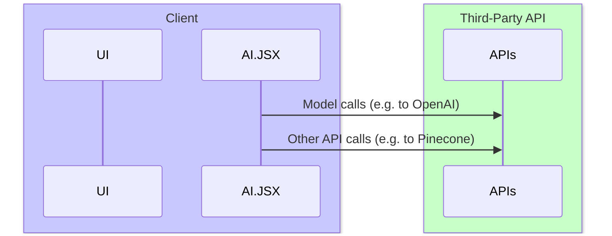
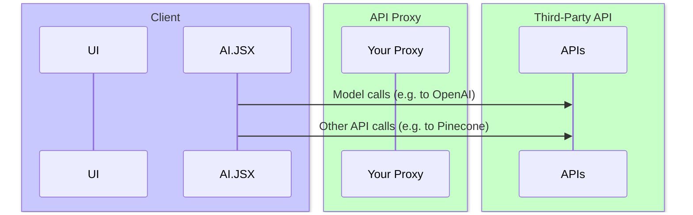
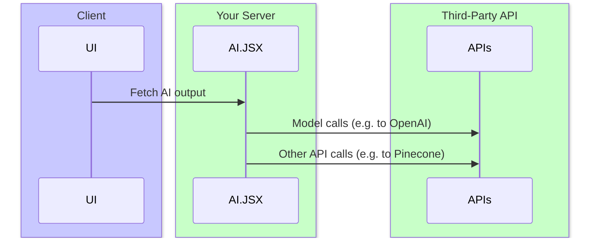
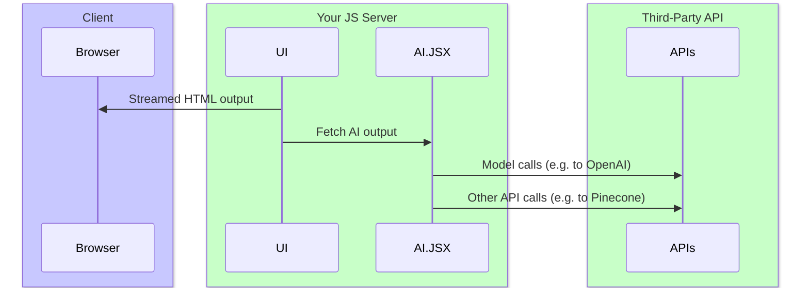
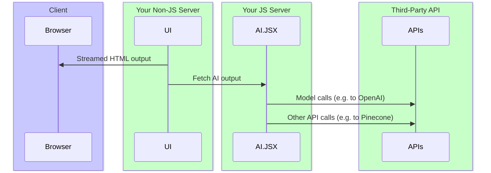

# Architecture

AI.JSX runs in both NodeJS and the browser, so you can choose an architecture that meets your needs. Here are some options, listed in order of most to least client logic:

1. [Run entirely on the client](#run-entirely-on-the-client)
1. [UI + AI.JSX on the client; API calls on the server](#ui--aijsx-on-the-client-api-calls-on-the-server)
1. [UI on the client; AI.JSX on the server](#ui-on-the-client-aijsx-on-the-server)
1. [Run entirely on the server](#run-entirely-on-the-server)

The key tradeoffs are:

- Whether you need to protect API keys
- Where you want to put serialization boundaries
- Latency (as a result of roundtrips)
- How reusable your AI.JSX logic is

:::note What are roundtrips?
A roundtrip is when your client needs to make a connection to your backend. Depending on the quality of the user's network connection, this can have a big negative impact on performance. As a result, many performance strategies involve minimizing roundtrips.

Any clientside app can have roundtrips (calling out to APIs, etc). With AI apps, we add a new type of roundtrip: calling out to a model provider (e.g. OpenAI).

The amount of roundtrips in your logic depends on how you structure your AI.JSX program. A program with many sequential calls out to a model will have more roundtrips than one that does a single shot. (Of course, unlike traditional API calls, model calls are so slow that the client/server latency is a less important contributor to the overall performance profile.)

For more details, see [Performance](./performance.md).
:::

:::tip Where can AI.JSX run?
In addition to the client, AI.JSX can run in serverless/edge functions, traditional standalone servers, or any other NodeJS process.
:::

## Run Entirely on the Client

With a pure client-side approach, you run your UI and AI.JSX logic on the client. However, you still need to call out to external APIs for hosted services like model providers (e.g. GPT-4 from OpenAI) or databases (e.g. Pinecone).

Pros:

- Simple to implement
- The serialization boundary is at the API layer. The only way to access these APIs is through a serialization boundary, so your architecture isn't adding any new boundaries.

Cons:

- Your API keys are exposed to the client. (Not recommended for public apps.)
- Performance will suffer if you need to do many roundtrips



## UI + AI.JSX on the client; API calls on the server

This is just like the [Run Entirely on the Client](#run-entirely-on-the-client) pattern, except you add a proxy for API calls. You'd traditionally set this proxy up as a serverless or edge function. The proxy stores your API keys, keeping them safe from the client.

Pros:

- There's still only one serialization boundary.
- API keys are protected from the client.

Cons:

- Compared to pure client, it's a little more complicated because you need to set up a proxy.
- Performance will suffer if you need to do many roundtrips



## UI on the client; AI.JSX on the server

In this approach, your AI.JSX logic runs entirely in your backend environment.

Pros:

- You can access your AI.JSX logic from multiple clients (web app, native app, etc).
- API keys are secure.
- Performance will be less sensitive to roundtrips between AI.JSX and external APIs.

Cons:

- This introduces a new serialization boundary, which sits between the UI and your AI.JSX. This limits how seamless your UI/AI integration can be.



### What's the downside of the new serialization boundary?

When AI.JSX and the UI are both on the client, you can do things like:

```tsx
const dataPromise = getMyPromise();

<div>
  <AI.jsx>
    <ChatCompletion temperature={1}>
      // highlight-next-line
      <UserMessage>Write me a poem about {dataPromise}</UserMessage>
    </ChatCompletion>
  </AI.jsx>
</div>;
```

In this example, we have a value from our UI logic, `dataPromise`, and we embed it seamlessly in our AI logic. This is possible because the UI and AI logic are running together on the client.

If the AI.JSX logic lived entirely serverside, then we'd need to serialize everything that gets sent between the UI and AI layers.

Because of this, JIT UI is not supported with the "UI on the client / AI on the server" pattern. (It's straightforward for us to add support for this, but we haven't done so yet.)

## Run entirely on the server

In this approach, you generate your HTML on the server and stream it to the client. If your app is full-stack JS, you'd typically do this with the help of a server-side rendering framework like [NextJS](https://nextjs.org/).

Pros:

- [Server-side rendering is often a performance win.](https://nextjs.org/docs/getting-started/react-essentials)
- API keys are secure.

Cons:

- In JS, requires use of a framework like [NextJS](https://nextjs.org/) to get the full benefits. (NextJS is a great choice for new apps, but existing codebases may not be able to adopt it immediately.)



Or, if you're generating HTML from a non-JS app (like Django), you'd have a separate NodeJS service that runs your AI.JSX logic:


