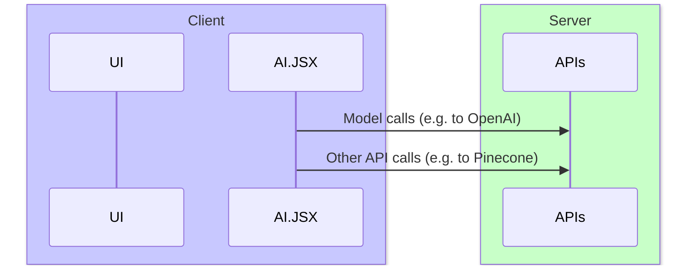

# Architecture

AI.JSX runs in both NodeJS and the browser, so you can choose an architecture that meets your needs. Here are some options, listed in order of most to least client logic:

1. [Run entirely on the client](#run-entirely-on-the-client)
1. [UI + AI.JSX on the client; API calls on the server](#ui--aijsx-on-the-client-api-calls-on-the-server)
1. [UI on the client; AI.JSX on the server](#ui-on-the-client-aijsx-on-the-server)
1. [Run entirely on the server](#run-entirely-on-the-server)

The key tradeoffs are:
* Whether you need to protect API keys
* Where you want to put serialization boundaries
* Latency (as a result of roundtrips)
* How reusable your AI.JSX logic is

:::note What are roundtrips?
A roundtrip is when your client needs to make a connection to your backend. Depending on the quality of the user's network connection, this can have a big negative impact on performance. As a result, many performance strategies involve minimizing roundtrips.

Any clientside app can have roundtrips (calling out to APIs, etc). With AI apps, we add a new type of roundtrip: calling out to a model provider (e.g. OpenAI).

The amount of roundtrips in your logic depends on how you structure your AI.JSX program. A program with many sequential calls out to a model will have more roundtrips than one that does a single shot. (Of course, unlike traditional API calls, model calls are so slow that the client/server latency is a less important contributor to the overall performance profile.)

For more details, see [Performance](./performance.md).
:::

## Run Entirely on the Client

With a pure client-side approach, you run your UI and AI.JSX logic on the client. However, you still need to call out to external APIs for hosted services like model providers (e.g. GPT-4 from OpenAI) or databases (e.g. Pinecone).

Pros:
* Simple to implement
* The serialization boundary is at the API layer. The only way to access these APIs is through a serialization boundary, so your architecture isn't adding any new boundaries.

Cons:
* Your API keys are exposed to the client.
* Performance will suffer if you need to do many roundtrips

## UI + AI.JSX on the client; API calls on the server

## UI on the client; AI.JSX on the server

## Run entirely on the server
