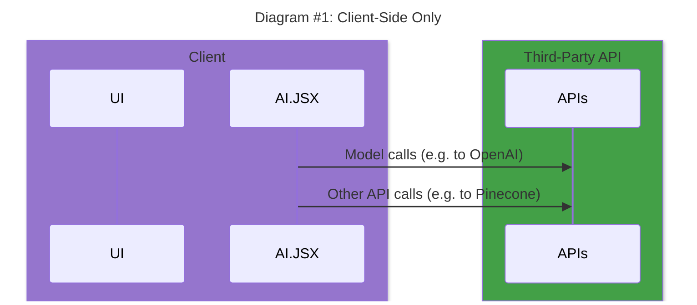
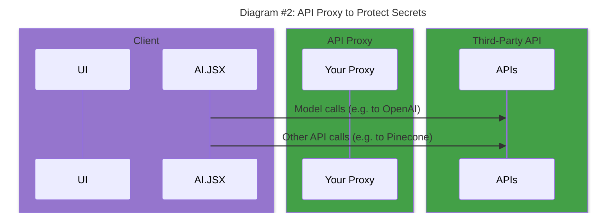
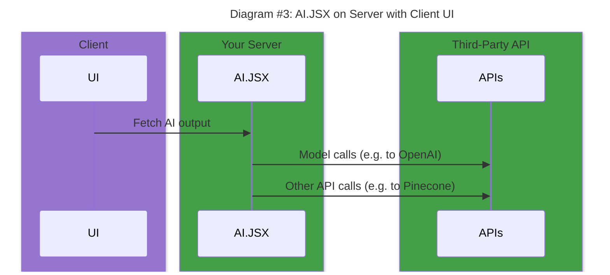
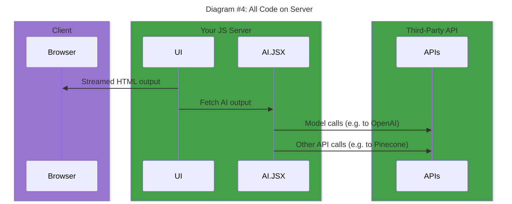
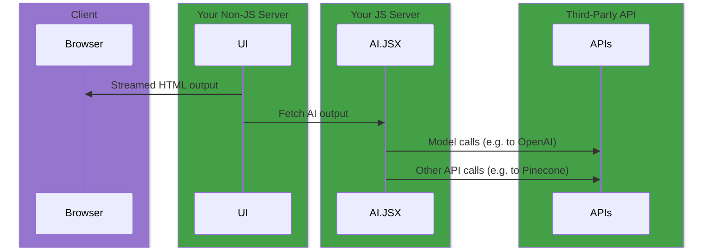

export const Highlight = ({ children, color, textColor }) => (
  <span
    style={{
      backgroundColor: color,
      borderRadius: '10px',
      color: textColor || '#fff',
      padding: '0.3rem',
      textTransform: 'uppercase',
      fontSize: '11px',
    }}
  >
    {children}
  </span>
);

:::note See Also

- [Performance](./performance.md) - Discusses trade-offs between performance and correctness. Presents five strategies for improving performance in your AI-powered apps.
- [AI+UI](./ai-ui.md) - Covers how AI.JSX enables dynamically created UI ("Just in Time" UI) and the approaches that can be used.
  :::

AI.JSX runs in both NodeJS and the browser. It can fit in no matter how you are deploying your application. This guide covers the five architectural approaches we expect most AI-apps to use and also discusses the key trade-offs and considerations for each one.

## Summary: Architectural Deployment Options

The five architectural approaches (listed in order from most client-side logic to least) are:

1. [Client-Side Only](#architecture-1-client-side-only) <Highlight color="rgb(230, 246, 230)" textColor="rgb(0, 49, 0)">Great for Hackathons</Highlight>
1. [API Proxy](#architecture-2-api-proxy)
1. [AI.JSX Server-Side + Client UI](#architecture-3-aijsx-server-side--client-ui) <Highlight color="#4cb3d4">Recommended</Highlight>
1. [Server-Side Only (SSR)](#architecture-4-server-side-only-ssr) <Highlight color="#DDD" textColor="#000">In Progress</Highlight>
1. [Headless AI](#architecture-5-headless-ai)

:::tip Recommendation/TL;DR
For new projects we recommend using the [AI.JSX Server-Side + Client UI](#architecture-3-aijsx-server-side--client-ui) pattern with [NextJS](https://nextjs.org/).
:::

## Key Trade-Offs

If you are just trying to get something running at a hackathon, approach #1 is the way to go. For new projects we recommend #3. Aside from those quick recommendations, there are a few factors you will want to consider before choosing how you want to deploy your application:

### Securing API keys

Do you need to protect your API keys? If you are creating a prototype or a hackathon project then you can probably just put the keys in your client-side code. However, if you are deploying to production then having your API keys out in the open could lead to awkward call from your accountant when the bill comes in. Better make sure those keys are protected!

### Serialization Boundaries

More boundaries can introduce complexity yet can add more flexibility. Do you need the extra complexity or can you keep it simple?

When AI.JSX and the UI are both on the client, you can do things like:

```tsx
const dataPromise = getMyPromise();

<div>
  <AI.jsx>
    <ChatCompletion temperature={1}>
      // highlight-next-line
      <UserMessage>Write me a poem about {dataPromise}</UserMessage>
    </ChatCompletion>
  </AI.jsx>
</div>;
```

In this example, we have a value from our UI logic, `dataPromise`, and we embed it seamlessly in our AI logic. This is possible because the UI and AI logic are running together on the client.

If we split things up and have UI on the client and the AI.JSX logic on the server, we need to serialize everything that gets sent between the UI and AI layers.

### Latency

As discussed in the [Performance Guide](./performance.md), more round trips will increase latency in our app. Having code running on the server can reduce latency incurred by calling 3rd party APIs.

### Component Integration

Does your app need to integrate AI right into UI components?

:::note Where can AI.JSX run?
In addition to the client, AI.JSX can run in serverless/edge functions, traditional standalone servers, or any other NodeJS process.
:::

## Architecture #1: Client-Side Only

With a pure, client-side only approach, you run your UI and AI.JSX logic on the client. However, you still need to call out to external APIs for hosted services like model providers (e.g. GPT-4 from OpenAI) or databases (e.g. Pinecone).



**Pros:**

- **Easy** -> Easy to get started and simple to implement.
- **Simplicity** -> The serialization boundary is at the API layer. The only way to access these APIs is through a serialization boundary and this pattern isn't adding any new boundaries.

**Cons:**

- **Insecure Keys** -> Your API keys are exposed to the client. (Not recommended for public apps.)
- **Potential for Performance Issues** -> Performance will suffer if you need to do many roundtrips.

:::info Runable Example
In the [ai-jsx monorepo](https://github.com/fixie-ai/ai-jsx), run the following command from the repo root for a demo of this architecture:

```console
OPENAI_API_KEY=my-key yarn turbo run dev --scope create-react-app-demo
```

:::

## Architecture #2: API Proxy

This is just like the [Client-Side Only](#architecture-1-client-side-only) pattern, except we secure our keys by adding a proxy. You'd traditionally set this proxy up as a serverless or edge function. The proxy stores your API keys, keeping them safe from the client.



**Pros:**

- **Simplicity** -> There is still only one serialization boundary.
- **Secure Keys** -> API keys are secured by the proxy and no longer visible in the client-side code.

**Cons:**

- **Complexity** -> The addition of the proxy adds some complexity over having everything client-side only.
- **Potential for Performance Issues** -> Performance will suffer if you need to do many roundtrips.

:::info Runable Example
In the [ai-jsx monorepo](https://github.com/fixie-ai/ai-jsx), run the following command from the repo root for a demo of this architecture:

```console
OPENAI_API_BASE='/v1' yarn turbo run dev --scope create-react-app-demo
```

See `packages/create-react-app-demo/backend/index.ts` for a sample proxy server.

Alternatively, use [this template repo](https://github.com/fixie-ai/ai-jsx-template-cra-with-vercel-proxy) for an example that uses a [Vercel edge function](https://vercel.com/docs/concepts/functions/edge-functions).
:::

## Architecture #3: AI.JSX Server-Side + Client UI

:::tip Recommendation
This is the most stable way to run and deploy an AI.JSX powered app at the moment.
:::

In this approach, your AI.JSX logic runs entirely in your backend environment.



**Pros:**

- **Flexibility** -> Your AI.JSX logic can be access from multiple clients (web app, native app, etc.).
- **Secure Keys** -> API keys are secured by the proxy and no longer visible in the client-side code.
- **Performance** -> Performance will be less sensitive to rountrips between AI.JSX and external APIs.

**Cons:**

- **Fragmentation** -> Introduces a new serialization boundary between the UI and your AI.JSX code. This means the integration of the UI and AI won't be as seamless.

## Architecture #4: Server-Side Only (SSR)

:::caution

Running entirely on the server is still a work in progress.

:::

In this approach, you generate your HTML on the server and stream it to the client. If your app is full-stack JS, you'd typically do this with the help of a framework like [NextJS](https://nextjs.org/).



Or, if you're generating HTML from a non-JS app (like Django), you'd have a separate NodeJS service that runs your AI.JSX logic:



**Pros:**

- **Secure Keys** -> API keys are secured by the proxy and no longer visible in the client-side code.
- **Performance** -> Server-side rendering (SSR) is [often a performance win](https://nextjs.org/docs/getting-started/react-essentials).

**Cons:**

- **Complexity** -> Requires the use of a framework like [NextJS](https://nextjs.org/) to get the full benefits. Adoption of a new framework can have a learning curve or may not be feasible in an existing code base.

## Architecture #5: Headless AI

With this pattern, your AI does not directly feed any UI. Instead of acting in response to user actions, it may run offline as part of a batch process. Your app may be triggered by [a cron service](https://render.com/docs/cronjobs), [task queue](https://www.inngest.com/), or some other kind of [background job](https://www.defer.run/).

Instead of UI, the output of your app may be writing to a data store, the file system, etc.
