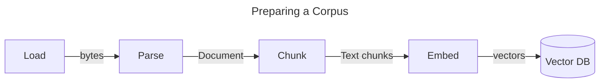
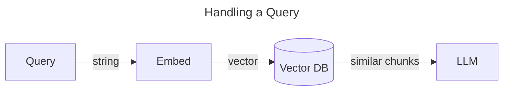

# DocsQA: Grounding Answers with a Source of Truth

Large Language Models (LLMs) are powerful tools for answering open domain questions, but they're prone to making things up (["hallucination"](<https://en.wikipedia.org/wiki/Hallucination_(artificial_intelligence)>)) when their responses are unrestricted. In addition, publicly available LLMs are trained on public data and consequently won't have knowledge of your internal information (documents, data, documentation, etc.).

One of the common ways to handle both of these issues is to provide the LLM with the content of documents that should be treated as a source of truth. This is called "Document Q&A" or, simply, "DocsQA."

Simple prompting along with the context provided by these additional documents helps avoid hallucination by restricting the domain of responses. At the same time, these additional documents provide new knowledge from internal sources which allows the LLM to give more useful, targeted responses.

Don't worry if this doesn't all make sense yet...keep on reading!

## Preparing a Corpus

A collection of docs is called a "corpus" (plural "corpora"). Often corpora are backed by a "vector database" that allows for searching over knowledge in a semantically grounded vector space. Once we have this set-up, we can then make queries against the vector DB to provide docs to an LLM (see [Handling a Query](#handling-a-query) below).



If you already have a populated corpus available, you can use that (for example with `LangchainCorpus`).
Otherwise we need to populate a corpus before we can search it. We do that via the following steps:

### Step 1: Loading (and Parsing)

Step 1 is identifying the documents you care about. In the simplest case, this may be a static list of text files you've already downloaded that you can simply read into memory. In more complex cases, this could involve crawling the web or reading from a database.

Regardless of where your documents reside, you'll need to implement a "Loader" to bring them into your program. The "Loader" interface provided by AI.JSX allows for loading documents from any source with appropriate parallelization and pagination. In the simple case, the `loader` can be a thin wrapper around `fs.readFile`.

For non-text documents (PDFs, Word docs, podcasts, etc.), you'll need to convert the raw document bytes into a text representation. In this case, you'll use AI.JSX's "RawLoader" along with a "Parser" where the former is responsible for finding the document and getting it into memory and the latter is responsible for turning it into text.

:::tip Fixie Handles Parsing
When using a Fixie corpus, Fixie can handle parsing for most common documents types for you.
:::

### Step 2: Vectorizing

Now that you have text documents, you'll need to split them into "chunks" so that several can fit in your LLM's [context window](./brand-new.md#context-window) and you'll need to [embed](./brand-new.md#semantic-similarity-embeddings) them into your corpus's vector space. These are done with a [`Chunker`](../api/modules/batteries_docs#chunker) and an [`Embedding`](../api/interfaces/batteries_docs.Embedding.md) respectively. AI.JSX provides defaults for each of these, but you're free to swap these out however you'd like. This could be especially useful when combined with a custom loader and parser for non-text documents since there may be semantic meaning that could be inferred from the document structure itself that wouldn't necessarily be captured by the defaults.

See also: [Pinecone Guidance on Chunking Strategies](https://www.pinecone.io/learn/chunking-strategies/).

With vectors in hand, your text chunks can be added to a vector database. When responding to a query, your corpus will embed the query with the same Embedding and use the vector database to find the query vector's nearest neighbors, returning the text chunks associated with them.

### Starting and Monitoring Loading

The AI.JSX [`LoadableCorpus`](../api/classes/batteries_docs.LoadableCorpus) interface provides a [`load`](../api/classes/batteries_docs.LoadableCorpus#load) method that will begin loading and vectorizing documents so they're available for querying later. It also provides a [`getStats`](../api/classes/batteries_docs.LoadableCorpus#getstats) method so you can inspect a corpus's progress.

```typescript
// Have the corpus begin loading. This promise may take a while to resolve, but we'll be ready to
// use the Corpus when it does.
const loadingPromise = corpus.load();

// Optional: Poll loading state until loading has completed.
let stats = corpus.getStats();
while (stats.loadingState !== CorpusLoadingState.COMPLETED) {
  await sleep(5000);
  stats = corpus.getStats();
  if (stats.loadingState === CorpusLoadingState.FAILED) {
    throw Error(`Corpus failed to load. Final stats: ${stats}`);
  }
}
console.log(`Finished indexing ${stats.numDocuments} documents, chunk count=${stats.numChunks}`);

// Alternative:
const stats = await loadingPromise;
console.log(`Finished indexing ${stats.numDocuments} documents, chunk count=${stats.numChunks}`);

function sleep(millis: number) {
  return new Promise((resolve) => setTimeout(resolve, millis));
}
```

Typically you'll want to make sure a corpus has completed loading before exposing it to your users, but for small corpora loading just in time can work as well.

## Handling a Query

Once your corpus is created and ready to serve, its primary function will be to identify content (e.g. chunks of text) that is semantically similar to a user query. The process will look something like this:



If you use the built-in `DocsQA` component from AI.JSX, then you just need to decide how to present the chunk to your LLM:

```typescript
function ShowDoc({ doc }: { doc: Document<MyDocMetadata> }) {
  return (
    <>
      Title: {doc.metadata?.title ?? doc.name ?? 'Untitled'}
      Content: {doc.pageContent}
    </>
  );
}

function AskAndAnswer({ query }: { query: string }) {
  return (
    <>
      Q: {query}
      {'\n'}
      A: <DocsQA question={query} corpus={corpus} docComponent={ShowDoc} />
    </>
  );
}
```

The `DocsQA` component provides an answer, like:

```tsx
<DocsQA question="What is the atomic number of nitrogen?" corpus={corpus} docComponent={ShowDoc} />
/* Renders:
    Nitogen's atomic number is 7
*/
```

If you want an answer that cites sources, use `DocsQAWithSources`:

```tsx
<DocsQAWithSources question="What is the atomic number of nitrogen?" 
  corpus={corpus} docComponent={ShowDoc} />
/* Renders:
    Nitogen's atomic number is 7
    Sources: https://en.wikipedia.org/wiki/Nitrogen
*/
```

If you want to customize how the citations are formatted, pass a `resultsFormatter`:

```tsx
function ResultFormatter(result: QAWithSourcesResult) {
  return <>
    {result.answer}
    {result.sources.length && <>
      Learn more:{'\n'}
      {result.sources.map(source => <>* {source}{'\n'}</>)}
    </>}
  </>
}

<DocsQAWithSources 
  question="What is the atomic number of nitrogen?"
  corpus={corpus} docComponent={ShowDoc}
  // highlight-next-line
  resultFormatter={ResultFormatter}
/>
/* Renders:
    Nitogen's atomic number is 7
    Learn more:
    * https://en.wikipedia.org/wiki/Nitrogen
*/
```

## Picking a Corpus Implementation

To get you started, AI.JSX includes an in-memory corpus that can be used effectively for demos. When you've outgrown that, you could use a Langchain VectorStore like [Pinecone](https://www.pinecone.io/) or [Chroma](https://www.trychroma.com/). Alternatively, [Fixie](https://www.fixie.ai) provides a fully-managed Corpus solution you could drop in instead.
