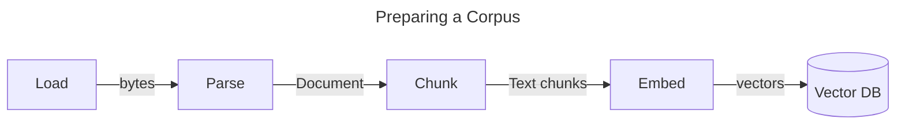
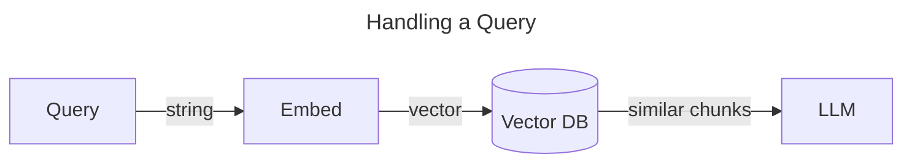

# Grounding Answers with a Source of Truth - DocsQA

Large Language Models (LLMs) are powerful tools for answering open domain questsions, but they're prone to making things up ("hallucination") when their responses are unrestricted. In addition, publicly available LLMs are trained on public data and consequently won't have knowledge of your internal documentation.

One of the common ways to handle both of these issues is to provide the LLM with the content of documents that should be treated as a source of truth. This is called "Document Q&A" or "DocsQA." Simple prompting along with document context avoids hallucination by restricting the domain of responses. At the same time, providing new knowledge from internal sources allows the LLM to give more useful responses.

## Overview

A collection of docs is called a "corpus" (plural "corpora"). Often corpora are backed by a "vector database" that allows for searching over knowledge in a semantically grounded vector space. To use a corpus with an LLM, you'll have a process like the one below. (Don't worry if this doesn't all make sense yet - we'll explain it!)





## Preparing a Corpus

In order for a corpus to find text relevant to a given query, it first needs to be prepared with the text it may return. There are a few steps involved:

### Step 1: Loading (and Parsing)

Step 1 is identifying the documents you care about. In the simplest case, this may be a static list of text files you've already downloaded that you can simply read into memory. In more complex cases, this could involve crawling the web or reading from a database.

Regardless of where your documents reside, you'll need to implement a "Loader" to bring them into your program. The "Loader" interface provided by ai.jsx allows for loading documents from any source with appropriate parallelization and pagination.

For non-text documents (PDFs, Word docs, podcasts, etc.), you'll need to convert the raw document bytes into a text representation. In this case, you'll use ai.jsx's "RawLoader" along with a "Parser" where the former is responsible for finding the document and getting it into memory and the latter is responsible for turning it into text.

Note: When using a Fixie corpus, Fixie can handle parsing for most common documents types for you.

### Step 2: Vectorizing

Now that you have text documents, you'll need to split them into "chunks" so that several can fit in your LLM's [context window](./brand-new.md#context-window) and you'll need to [embed](./brand-new.md#semantic-similarity-embeddings) them into your corpus's vector space. These are done with a "Chunker" and an "Embedding" respectively. Ai.jsx provides defaults for each of these, but you're free to swap these out however you'd like. This could be especially useful when combined with a custom loader and parser for non-text documents since there may be semantic meaning that could be inferred from the document structure itself that wouldn't necessarily be captured by the defaults.

See also: [Pinecone Guidance on Chunking Strategies](https://www.pinecone.io/learn/chunking-strategies/).

With vectors in hand, your text chunks can be added to a vector database. When responding to a query, your corpus will embed the query with the same Embedding and use the vector database to find the query vector's nearest neighbors, returning the text chunks associated with them.

### Starting and Monitoring Loading

The ai.jsx "Corpus" interface provides a "startLoading" method that will begin loading and vectorizing documents so they're available for querying later. It also provides a "getStats" method so you can inspect a corpus's progress.

Typically you'll want to make sure a corpus has completed loading before exposing it to your users, but for small corpora loading just in time can work as well.

## Responding to Queries

Once your corpus is ready to serve, it's function will be to identify text chunks that are semantically similar to a user query. If you use the built-in DocsQA tag from ai-jsx, then you just need to decide how to present the chunk to your LLM:

```typescript
function ShowDoc({ doc }: { doc: Document<MyDocMetadata> }) {
  return (
    <>
      Title: {doc.metadata?.title ?? doc.name ?? 'Untitled'}
      Content: {doc.pageContent}
    </>
  );
}

function AskAndAnswer({ query }: { query: string }) {
  return (
    <>
      Q: {query}
      {'\n'}
      A: <DocsQA question={query} corpus={corpus} docComponent={ShowDoc} />
    </>
  );
}
```

## Picking a Corpus Implementation

To get you started, ai.jsx includes an in-memory Corpus that can be used effectively for demos. When you've outgrown that, you could consider implementing your own Corpus backed by [Pinecone](https://www.pinecone.io/) or [Chroma](https://www.trychroma.com/). Alternatively, [Fixie](https://www.fixie.ai) provides a fully-managed Corpus solution you could drop in instead.
