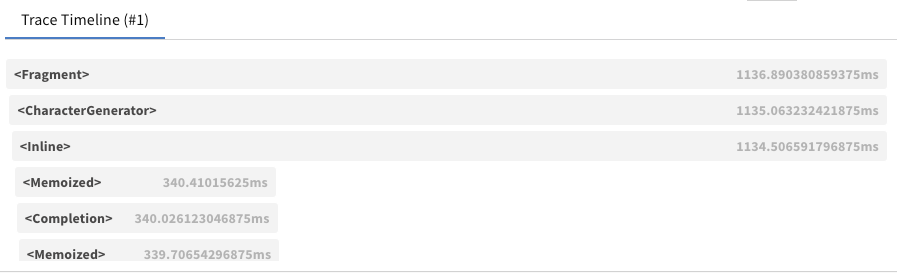

# Observability

In this guide, we'll start with the Hello World example from the [AI JSX template](https://github.com/fixie-ai/ai-jsx-template) and iteratively add logging.

```tsx file="index.tsx"
import * as AI from 'ai-jsx';
import { ChatCompletion, SystemMessage, UserMessage } from 'ai-jsx/core/completion';

function App() {
  return (
    <ChatCompletion>
      <SystemMessage>You are an agent that only asks rhetorical questions.</SystemMessage>
      <UserMessage>How can I learn about Ancient Egypt?</UserMessage>
    </ChatCompletion>
  );
}

console.log(await AI.createRenderContext().render(<App />));
```

This produces no logging.

## Console Logging of LLM Calls

To log to the console, set the `AIJSX_LOG` environment variable to the desired log level (for example `"info"` or `"debug"`).

```sh
AIJSX_LOG=debug node ./my-ai-jsx-program.tsx
```

Now you should see JSON log events written to the console, such as

```json
{
  "level": 20,
  "time": 1686758739756,
  "pid": 57473,
  "hostname": "my-hostname",
  "name": "ai-jsx",
  "chatCompletionRequest": {
    "model": "gpt-3.5-turbo",
    "messages": [
      { "role": "system", "content": "You are an agent that only asks rhetorical questions." },
      { "role": "user", "content": "How can I learn about Ancient Egypt?" }
    ],
    "stream": true
  },
  "renderId": "6ce9175d-2fbd-4651-a72f-fa0764a9c4c2",
  "element": "<OpenAIChatModel>",
  "msg": "Calling createChatCompletion"
}
```

To view this in a nicer way, pipe the console output to `pino-pretty`:

```sh
AIJSX_LOG=debug node ./my-ai-jsx-program.tsx | npx pino-pretty
```

`pino-pretty` has a number of [options](https://github.com/pinojs/pino-pretty#cli-arguments) you can use to further configure how you view the logs.

You can use `grep` to filter the log to just the events or loglevels you care about.

You may also specify a file for log events as well by putting a path after level, separated by ':' character:

```sh
AIJSX_LOG=debug:/tmp/ai-jsx.log node ./my-ai-jsx-program.tsx
```

Now logs will be appended to `/tmp/ai-jsx.log`.

### Fully Custom Logging

Pino is provided above as a convenience. However, if you want to implement your own logger, you can create a class that extends `LogImplementation`. The `log` method on your implementation will receive all log events:

```tsx
/**
 * @param level The logging level.
 * @param element The element from which the log originated.
 * @param renderId A unique identifier associated with the rendering request for this element.
 * @param metadataOrMessage An object to be included in the log, or a message to log.
 * @param message The message to log, if `metadataOrMessage` is an object.
 */
log(
  level: LogLevel,
  element: Element<any>,
  renderId: string,
  metadataOrMessage: object | string,
  message?: string
): void;
```

A custom `LogImplementation` can be passed to `createRenderContext` via the `logger` option:

```ts
AI.createRenderContext({ logger: new CustomLogImplementation() });
```

:::note NextJS

When using NextJS, instead of specifying a logger in `createRenderContext`, you can pass one to the props of your `<AI.JSX>` tag.

:::

## Producing Logs

The content above talks about how you can consume logs. In this section, we'll talk about how they're produced.

### Logging From Within Components

Components take props as the first argument and [ComponentContext](https://github.com/fixie-ai/ai-jsx/blob/79444f809201b1d9dd0525239afcdd83e091818d/packages/ai-jsx/src/index.ts#L4) as the second:

```tsx
function MyComponent(props, componentContext) {}
```

Use `componentContext.logger` to log;

```tsx
function MyComponent(props, { logger }) {
  logger.debug({ key: 'val' }, 'message');
}
```

The logger instance will be automatically bound with an identifier for the currently-rendering element, so you don't need to do that yourself.

### Creating Logger Components

:::caution
This is an advanced use case.
:::

Sometimes, you want a logger that wraps every `render` call for part of your component tree. For instance, the `OpenTelemetryTracer` creates [OpenTelemetry](https://opentelemetry.io/) spans for each component render. To do that, use the `wrapRender` method:

```tsx
/**
 * A component that hooks RenderContext to log instrumentation to stderr.
 *
 * @example
 *    <MyTracer>
 *      <MyComponentA />
 *      <MyComponentB />
 *      <MyComponentC />
 *    </MyTracer>
 */
function MyTracer(props: { children: AI.Node }, { wrapRender }: AI.ComponentContext) {
  // Create a new context for this subtree.
  return AI.withContext(
    // Pass all children to the renderer.
    <>{props.children}</>,

    // Use `wrapRender` to be able to run logic before each render starts
    // and after each render completes.
    ctx.wrapRender(
      (r) =>
        // This method has the same signature as `render`. We don't necessarily
        // need to do anything with these arguments; we just need to proxy them through.
        async function* (ctx, renderable, shouldStop) {
          // Take some action before the render starts
          const start = performance.now();
          try {
            // Call the inner render
            return yield* r(ctx, renderable, shouldStop);
          } finally {
            // Take some action once the render is done.
            const end = performance.now();
            if (AI.isElement(renderable)) {
              console.error(`Finished rendering ${debug(renderable, false)} (${end - start}ms @ ${end})`);
            }
          }
        }
    )
  );
}
```

This technique uses the [context affordance](./rules-of-jsx.md#context).

### OpenTelemetry Integration

AI.JSX includes an integration with [OpenTelemetry](https://opentelemetry.io/) to trace rendering. To enable it,
set the `AIJSX_ENABLE_OPENTELEMETRY` environment variable to `1`. [Spans](https://opentelemetry.io/docs/concepts/signals/traces/#spans)
are emitted for each element and capture:

- The input and output of each element
- Dependencies between elements
- Latency

Logs are automatically emitted to OpenTelemetry as well.

To learn more about configuring or deploying an OpenTelemetry collector, see the [Getting Started](https://opentelemetry.io/docs/collector/getting-started/)
page. The [examples project](https://github.com/fixie-ai/ai-jsx/blob/main/packages/examples/src/opentelemetry.ts) has a sample as well.

### Weights & Biases Tracer Integration

:::info
Requires an API key from Weights & Biases. Check out [their docs](https://docs.wandb.ai/guides) for more information.
:::

[W&B Prompts](https://docs.wandb.ai/guides/prompts/quickstart) provides a visual trace table that can be very useful
for debugging.
You can use W&B Prompts by wrapping your top-level component in a
[`<WeightsAndBiasesTracer>`](../api/modules/batteries_logging_integrations#weightsandbiasestracer)
as follows:

```tsx
import { wandb } from '@wandb/sdk';

await wandb.init();

console.log(
  await AI.createRenderContext().render(
    <WeightsAndBiasesTracer log={wandb.log}>
      <App />
    </WeightsAndBiasesTracer>
  )
);

await wandb.finish();
```

There are multiple things happening, so let's break them down:

1. Make sure to call `wandb.init()` and `wandb.finish()` before and after rendering the tracer;
1. The whole `<App />` is wrapped with a `<WeightsAndBiasesTracer>` to which we pass the `wandb.log` function;
1. By using `await`, we make sure that `wandb.init` is run first, and then the app render finishes before calling `wandb.finish`.

**Note:** Be sure to set `WANDB_API_KEY`: as an env variable for Node.js apps and via `sessionStorage.getItem("WANDB_API_KEY")` for browser apps. See https://docs.wandb.ai/ref/js/ for more info.

An example is also available at [`packages/examples/src/wandb.tsx`](https://github.com/fixie-ai/ai-jsx/blob/main/packages/examples/src/wandb.tsx), which you can run via:

```bash
yarn workspace examples demo:wandb
```


