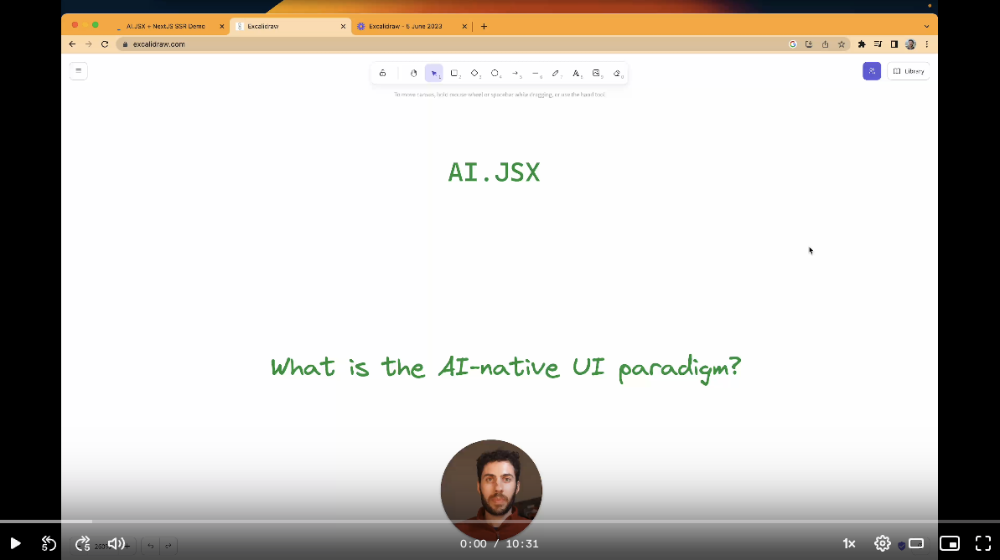

# AI.JSX

Overview video: [](https://www.loom.com/share/79ca3706839049a2beaf70f75950f86f)

Project vision: [Aspirational README](./docs/aspirational-readme.md)

[Strategy Notion doc](https://www.notion.so/fixieai/AI-JSX-Design-159fde6bf8d6466487eac3d4ee1f9a93?pvs=4)

## Working in this repo

We use [volta](https://volta.sh/) to manage the version of global tools like NodeJS and yarn. Once you install it, your command line should use the proper tools versions automatically.

### Monorepo

We use [TurboRepo](https://turbo.build/repo) and [yarn workspaces](https://yarnpkg.com/features/workspaces/#gatsby-focus-wrapper) to manage the [monorepo](https://turbo.build/repo/docs/handbook).

```
# Run a command at the top level:
$ yarn test

# Run a command for a particular monorepo package
$ yarn workspace @fixieai/ai-jsx add my-package-name
```

### Demos

Our primary means of manual verification that things are working is the demos. You can see a full list in [ai-jsx/package.json](./packages/ai-jsx/package.json). (It's all the `scripts` that start with `demo:`.)

Run a demo like this:

```
# Replace demo:loop with the name of your demo
yarn workspace @fixieai/ai-jsx run demo:loop
```

Most demos will produce results using the [inspector](./packages/ai-jsx/src/inspector/console.tsx), a bare-bones [Ink](https://github.com/vadimdemedes/ink) app:


The inspector shows the program output on the left hand side, and the debug tree on the right. The debug tree gives you some (imperfect) visibility into how your program was constructed. Use the left and right arrow keys to step through the debug tree.

Some key demos:

- `demo:zepp`: An implementation of the Zepp requirements
- `demo:loop`: Basic Docs QA
- `demo:debate`: Chat model used to generate competing sides in a debate
